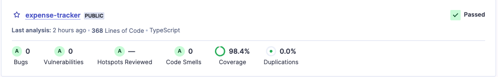

# expense-tracker
# MPESA Expense Tracker - Backend

## Overview

The backend component of the  MPESA Expense Tracker is developed using the FoalTS framework. 
This backend powers the APP for automatically parsing MPESA transaction messages.




## Features


- **User Authentication:** Allows users to register and log in securely to access their expense data.
- **Database Integration:** Uses a relational database (PostgreSQL) to store user information and parsed MPESA transactions.
- **Creates Expenses and Categories:** Implements predefined expense categories and categorizes transactions based on merchant details.
- **Expense Analytics:** (Planned) Provides users with analytics on spending patterns, including monthly expenditure and category-wise spending.
- **Notifications and Alerts:** (Planned) Sends notifications or alerts for unusual or high-value transactions.

## Tech Stack

- **Framework:** NodeJS, FoalTS, Prisma
- **Database:** PostgreSQL
- **Deployment:** [Hosting Platform, e.g., Heroku]
- **Testing Framework:** Mocha
- **Code Coverage:** NYC
- **Static Code Analysis:** SonarQube
  
## Getting Started

To run the backend locally, follow these steps:

1. Clone the repository:

   ```bash
   git clone https://pharez-dev/yourusername/expense-tracker.git

2. Install dependencies:
  
   ```bash
   cd expense-tracker
   npm install
   
4. Set up the database:
    ```bash
    npx prisma migrate dev --name init
   
6. Run the application:
    ```bash
     npm run dev
